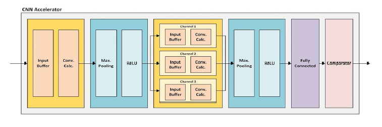

<div align="center">

# 🧠 Hardware Neural Network Accelerator

### A fully pipelined, RTL-level CNN accelerator for real-time MNIST handwritten-digit recognition on FPGA

[](LICENSE)

-orange)

-red)

</div>

---

## 📖 Overview

This project implements a **Convolutional Neural Network (CNN) inference accelerator entirely in Verilog RTL**, purpose-built to classify handwritten digits from the **MNIST dataset** in real time on FPGA fabric.

A compact CNN (two convolution layers + one fully-connected layer) is first trained in **PyTorch**, quantized to fixed-point, and its weights/biases are exported as `.mem` files. These are loaded directly into the hardware datapath, which streams a 28×28 pixel image in over **AXI4-Stream** and produces the predicted digit (0–9) as a streaming output — no software inference loop, no external accelerator library, just synthesizable hardware performing the full forward pass.

The repository also includes the **Zynq SoC-level integration** (ARM PS + AXI DMA + PL accelerator), a **Flask + HTML5 canvas web demo** for drawing digits, the **PyTorch training/quantization notebook**, and a full **testbench + test-vector suite** for RTL verification.

---

## 🏗️ System Architecture

### CNN Accelerator Datapath

The accelerator implements the classic LeNet-style pipeline as a chain of dedicated hardware blocks — pixels flow in one at a time and a one-hot decision streams out at the end, with every stage fully pipelined for back-to-back image throughput.



```
Input (28×28×1)
   │
   ▼
┌─────────────┐   ┌───────────┐   ┌────────────┐   ┌───────────┐
│ Input Buffer│──▶│ Conv. Calc│──▶│ Max Pooling│──▶│   ReLU    │
│ (line buf,  │   │ (3× 5×5   │   │  (2×2)     │   │           │
│  5×5 window)│   │  kernels) │   │            │   │           │
└─────────────┘   └───────────┘   └────────────┘   └───────────┘
      Conv1: 28×28×1 → 24×24×3 → MaxPool/ReLU → 12×12×3
                                        │
                                        ▼
                     ┌───────────────────────────────────┐
                     │   Conv2 (per channel: 3 in → 3 out)│
                     │   Ch.1: Input Buf + Conv Calc      │
                     │   Ch.2: Input Buf + Conv Calc      │
                     │   Ch.3: Input Buf + Conv Calc      │
                     └───────────────────────────────────┘
                        Conv2: 12×12×3 → 8×8×3
                                        │
                                        ▼
                              ┌────────────────┐
                              │ Max Pool + ReLU│  → 4×4×3 (48 values)
                              └────────────────┘
                                        │
                                        ▼
                              ┌────────────────┐
                              │ Fully Connected│  48 → 10
                              └────────────────┘
                                        │
                                        ▼
                              ┌────────────────┐
                              │   Comparator   │  argmax → 4-bit decision
                              └────────────────┘
                                        │
                                        ▼
                                Predicted Digit (0–9)
```

### FPGA SoC Integration (Zynq PS + PL)

The accelerator is designed as an **AXI4-Stream slave/master IP** that plugs directly into a Xilinx Zynq system, driven by an AXI DMA engine so the ARM core can stream image data in and read predictions back without CPU-bound compute.


| Domain | Component | Role |
|---|---|---|
| **Processing System (PS)** | ARM CPU | Loads image data into DDR, configures & triggers AXI DMA |
| **Processing System (PS)** | DDR Controller / DDR Memory | Stores input images and inference results |
| **Programmable Logic (PL)** | AXI DMA | Streams pixel data PS → PL (`AXI-Stream`) and results PL → PS |
| **Programmable Logic (PL)** | AXIS CNN Accelerator | The RTL CNN datapath described above |

Communication paths: `AXI_GP_0` (control, AXI-Lite) configures the DMA; `AXI_HP_0` (AXI-Full) gives the DMA high-bandwidth access to DDR; the DMA talks to the accelerator purely over `AXI-Stream`.

---

## 🔢 The CNN Model

The network is a compact 3-layer CNN trained in PyTorch on the standard MNIST dataset (60,000 training / 10,000 test images).

| Stage | Operation | Input Shape | Output Shape |
|---|---|---|---|
| 1 | Conv2D (1→3 channels, 5×5 kernel) | 28 × 28 × 1 | 24 × 24 × 3 |
| 2 | MaxPool (2×2) + ReLU | 24 × 24 × 3 | 12 × 12 × 3 |
| 3 | Conv2D (3→3 channels, 5×5 kernel) | 12 × 12 × 3 | 8 × 8 × 3 |
| 4 | MaxPool (2×2) + ReLU | 8 × 8 × 3 | 4 × 4 × 3 |
| 5 | Flatten | 4 × 4 × 3 | 48 |
| 6 | Fully Connected (Linear) | 48 | 10 |
| 7 | Argmax (Comparator) | 10 | 1 (digit class 0–9) |

**Training reference model** (`scripts/py_model/cnn_mnist.py`):

```python
class CNN(nn.Module):
    def __init__(self):
        self.conv1 = nn.Conv2d(1, 3, kernel_size=5)
        self.conv2 = nn.Conv2d(3, 3, kernel_size=5)
        self.mp    = nn.MaxPool2d(2)
        self.fc_1  = nn.Linear(48, 10)
    # forward(): conv1 → mp+relu → conv2 → mp+relu → flatten → fc_1 → log_softmax
```

The trained weights (`cnn_mnist.pt`) are used both by the software reference/demo path and as the source for hardware weight extraction.

### Fixed-Point Quantization

Since the RTL uses integer arithmetic, floating-point weights/biases are quantized before being loaded into hardware:

1. Each trained weight/bias is scaled by **128 (2⁷)**, i.e. converted to a **Q1.7 fixed-point** fractional representation, and rounded to an 8-bit integer.
2. Negative values are converted to **two's-complement** form.
3. Values are written out as **hex `.mem` files** (`np.savetxt(..., fmt='%1.2x')`) for direct loading into Verilog via `$readmemh`.
4. This full flow is documented in `scripts/ipynb/cnn_mnist-checkpoint.ipynb`, which also handles data loading, training, evaluation, `.bmp` sample testing, and `.mem` export for **all three layers** (Conv1 — 3 kernels, Conv2 — 9 kernels across 3×3 input/output channel pairs, and the FC layer).

---

## 📂 Repository Structure

```
Hardware-Neural-Network-Accelerator/
├── docs/
│   ├── architecture/
│   │   └── architecture.png        # CNN accelerator datapath diagram
│   └── images/
│       └── block dia.png           # Zynq PS/PL system block diagram
│
├── src/                             # Synthesizable RTL (Verilog)
│   ├── top/
│   │   └── axis_cnn_mnist.v         # Top-level AXI4-Stream wrapper & FSM sequencer
│   ├── layers/
│   │   ├── layer 1/                 # 1st Convolution Layer
│   │   │   ├── conv1_buf.v          #   5×5 sliding-window line buffer (28×28 input)
│   │   │   ├── conv1_calc.v         #   3-kernel MAC + pipelined adder tree + bias
│   │   │   └── conv1_layer.v        #   Wrapper combining buf + calc
│   │   ├── layer 2/                 # Pooling / Activation / Dense
│   │   │   ├── maxpool_relu.v       #   Parameterized 2×2 max-pool + ReLU
│   │   │   └── fully_connected.v    #   48-input × 10-output dense layer
│   │   └── layer 3/                 # 2nd Convolution Layer
│   │       ├── conv2_buf.v          #   Per-channel 5×5 line buffer (12×12 input)
│   │       ├── conv2_calc.v         #   3-in-channel × 3-out-channel MAC array
│   │       └── conv2_layer.v        #   Wrapper combining 3 buffers + 3 calc units
│   ├── utils/
│   │   └── comparator.v             # 10-way tree comparator → argmax decision
│   └── weights/                     # Quantized weight/bias ROM images (hex .mem)
│       ├── conv1_weight_{1,2,3}.mem, conv1_bias.mem
│       ├── conv2_weight_{11,12,13,21,22,23,31,32,33}.mem, conv2_bias.mem
│       └── fc_weight.mem, fc_bias.mem
│
├── testbench/
│   └── axis_cnn_mnist_tb.v          # Self-driving testbench (100 MHz clock model)
│
├── testvector/                      # Pre-formatted hex pixel streams for simulation
│   ├── 0_0.txt … 9_0.txt            # One sample digit per class (0–9)
│   └── input_1000.txt               # Batch of 1,000 test images for regression runs
│
├── scripts/
│   ├── ipynb/
│   │   └── cnn_mnist-checkpoint.ipynb  # Train → quantize → export .mem pipeline
│   ├── py_model/
│   │   ├── cnn_mnist.py             # PyTorch CNN model definition
│   │   └── cnn_mnist.pt             # Trained model checkpoint
│   ├── bmp files/                   # Sample MNIST digits exported as .bmp for testing
│   └── mnist_datasets/              # Raw MNIST dataset (IDX + gzip format)
│
├── sw/                               # Software demo / web front-end
│   ├── app.py                       # Flask server + PyTorch inference endpoint
│   └── index.html                   # HTML5 canvas UI — draw a digit, get a prediction
│
├── LICENSE                           # MIT License
└── README.md
```

---

## ⚙️ Hardware Design Details

### 🔹 Top-Level Module — `axis_cnn_mnist`

The top module exposes a standard **AXI4-Stream slave** (image pixel input) and **AXI4-Stream master** (classification output) interface:

| Port | Direction | Width | Description |
|---|---|---|---|
| `aclk`, `aresetn` | in | 1 | Clock and active-low synchronous reset |
| `s_axis_tdata` / `tvalid` / `tready` | in / in / out | 8 | Incoming pixel stream (one 8-bit grayscale pixel per cycle) |
| `m_axis_tdata` / `tvalid` / `tlast` | out / out / out | 8 | Outgoing result stream (`{4'b0, decision[3:0]}`) |

Internally, a **global counter-based sequencer** (`cnt_sequencer_reg`) generates the control timing for the entire pipeline:
- Accepts exactly **784 pixels** (28×28 image) while `s_axis_tready` is asserted.
- Drives `valid_in` into the Conv1 stage for cycles 1–841 to account for pipeline fill.
- Automatically **holds off new input** (deasserts `tready`) while the current image drains through the ~1280-cycle pipeline, then self-clears and accepts the next image.
- Asserts `m_axis_tvalid` / `m_axis_tlast` for a single cycle once the classification decision is valid.

### 🔹 Convolution Layer 1 — `conv1_layer` (`conv1_buf.v` + `conv1_calc.v`)

- **`conv1_buf`**: A 5-row × 28-column circular line buffer that reconstructs every valid **5×5 sliding window** from the streaming 28×28 input (stride 1, no padding → 24×24 valid positions), using a rotating `buf_flag` to always present the most recent 5 rows in the correct order.
- **`conv1_calc`**: Instantiates **3 independent 5×5 kernels** (`conv1_weight_1/2/3.mem`) loaded via `$readmemh`. Each kernel computes a fully unrolled **25-tap MAC** across a **4-stage pipelined adder tree** (25 multiplies → 13 → 6 → 3 → 1 sum), then adds a sign-extended bias to produce a 12-bit signed convolution output per channel.

### 🔹 Pooling + Activation — `maxpool_relu` (parameterized, reused twice)

A single parameterized module implements **2×2 max pooling fused with ReLU**, reused for both pooling stages via generic parameters (`CONV_BIT`, `HALF_WIDTH`, `HALF_HEIGHT`):
- Compares each 2×2 block online as data streams in (row-pair buffering with a `flag`/`state` machine), so no full feature-map buffer is needed.
- Clips negative results to zero (ReLU) at the exact cycle the final value of each 2×2 window is resolved.
- Used as `maxpool_relu_1` (12×12 window count, 24×24→12×12) and `maxpool_relu_2` (4×4 window count, 8×8→4×4).

### 🔹 Convolution Layer 2 — `conv2_layer` (`conv2_buf.v` + `conv2_calc.v`)

Implements a **3-input-channel → 3-output-channel** convolution (9 total 5×5 kernels):
- Three parallel `conv2_buf` instances (one per input channel) each generate 5×5 windows from the 12×12 pooled feature maps.
- Three `conv2_calc` instances (one per output channel) each sum the MAC results **across all three input channels** using per-channel weight sets (e.g. `conv2_weight_11/12/13.mem` for output channel 1), followed by bias addition — mirroring a standard multi-channel CNN convolution in hardware.

### 🔹 Fully Connected Layer — `fully_connected`

- Buffers the flattened **48 pooled activations** (4×4×3) from the second pooling stage.
- For each of the **10 output classes**, performs a fully unrolled **48-tap MAC** using weights loaded from `fc_weight.mem` / `fc_bias.mem`, computed over a multi-stage pipelined adder tree, and serializes the 10 results out one per cycle.

### 🔹 Final Decision — `comparator`

- Buffers the 10 FC outputs, then runs a **balanced binary-tree comparator** (5 → 3 → 2 → 1 max reduction) to find the arg-max.
- Outputs a **4-bit `decision`** signal (0–9) identifying the predicted digit, along with a `valid_out` strobe.

---

## 🧪 Verification

- **Testbench** (`testbench/axis_cnn_mnist_tb.v`): drives the DUT with a 100 MHz clock model, applies reset, then streams a 784-pixel test image (read via `$readmemh` from `testvector/`) through the AXI4-Stream slave interface — back to back for two consecutive images to validate pipeline re-use.
- **Test vectors** (`testvector/`): one representative sample per digit class (`0_0.txt` … `9_0.txt`, each a hex-formatted 28×28 pixel array) plus a larger `input_1000.txt` batch for extended regression testing.
- **Golden reference**: the PyTorch model (`scripts/py_model/cnn_mnist.py` + `cnn_mnist.pt`) and training notebook can be used to independently verify expected classification results and intermediate feature-map values for the same inputs.

---

## 🖥️ Software Demo

A lightweight web app is included to interactively test digit recognition:

- **`sw/app.py`** — A Flask server that loads the trained PyTorch model (`cnn_mnist.pt`), accepts a base64-encoded canvas image via POST, preprocesses it (grayscale, resize to 28×28, normalize), runs inference, and returns the predicted digit as JSON.
- **`sw/index.html`** — A browser UI (Bootstrap + Paper.js) providing a drawable canvas where a user sketches a digit, clicks **Predict**, and sees the recognized digit — serving as a fast software-side reference for what the hardware accelerator should output.

**Run it locally:**

```bash
cd sw
pip install flask torch torchvision pillow numpy
python app.py
# open http://localhost:5000 in your browser
```

---

## 🚀 Getting Started

### 1. Simulate the RTL
```bash
# Using any Verilog simulator (e.g. Icarus Verilog, ModelSim, Vivado Simulator)
cd testbench
iverilog -o sim.out axis_cnn_mnist_tb.v ../src/top/axis_cnn_mnist.v \
    "../src/layers/layer 1/conv1_layer.v" "../src/layers/layer 1/conv1_buf.v" "../src/layers/layer 1/conv1_calc.v" \
    "../src/layers/layer 2/maxpool_relu.v" "../src/layers/layer 2/fully_connected.v" \
    "../src/layers/layer 3/conv2_layer.v" "../src/layers/layer 3/conv2_buf.v" "../src/layers/layer 3/conv2_calc.v" \
    ../src/utils/comparator.v
vvp sim.out
```
> Ensure the `.mem` weight files in `src/weights/` are copied alongside the simulation working directory, and that the test vector path inside the testbench matches your local layout.

### 2. Retrain / Re-quantize the Model
Open `scripts/ipynb/cnn_mnist-checkpoint.ipynb` in Jupyter to retrain the CNN on MNIST, evaluate accuracy, and regenerate the `.mem` weight/bias files used by the RTL.

### 3. Integrate on FPGA
Package `src/top/axis_cnn_mnist.v` (and its sub-modules) as a custom AXI4-Stream IP, connect it to an **AXI DMA** in a Zynq block design as shown in the [system diagram](#-fpga-soc-integration-zynq-ps--pl) above, and drive it from the ARM PS to stream images from DDR and read back predictions.

---

## 📜 License

This project is licensed under the **MIT License** — see [`LICENSE`](LICENSE) for details.

---

<div align="center">

*A complete hardware/software co-design pipeline — from PyTorch training to fixed-point quantization to synthesizable RTL — for real-time CNN inference on FPGA.*

</div>
